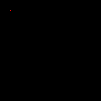

# Code Art Class

## Lesson 1: Draw a point

In this lesson, we'll learn how to draw a point:

In the computer world, all pictures are made of pixels. Pixels are addressed by 2 numbers: X and Y. For example, the top left pixel in a picture is `(X=1, Y=1)`, or simply `(1, 1)`. To move to the right, you increase the value of `X`, and to move down, you increase the value of `Y`. Here's what this looks like:

## Challenge

Draw something by modifying the `point.py` program and draw more points. Draw a smily face or something else if you prefer.

