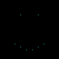

# Code Art Class

## Lesson 1: Draw a point

In this lesson, we'll learn how to draw a point:

In the computer world, all pictures are made of pixels. Pixels are addressed by 2 numbers: X and Y. For example, the top left pixel in a picture is `(X=0, Y=0)`, or simply `(0, 0)`. To move to the right, you increase the value of `X`, and to move down, you increase the value of `Y`. Here's what this looks like:

## Challenges

For the following challenges, copy the `point.py` file to be `point1.py` for Challenge 1, `point2.py` for Challenge 2, etc.

### Challenge 1

Change the color of the pixel from `red` to something else.

### Challenge 2

Draw point in top left.

### Challenge 3

Draw point in bottom right.

### Challenge 4

Draw point in bottom left.

### Challenge 5

Draw point in top right.

### Challenge 6

Draw a point in the center so that its always in the center.

### Challenge 7

Draw a point in the center so that its always in the center (even if you resize the image). Hint: use the `img_width` and `img_height` variables.

### Challenge 8

Draw something by modifying the `point.py` program and draw more points. Draw a smily face or something else if you prefer.
