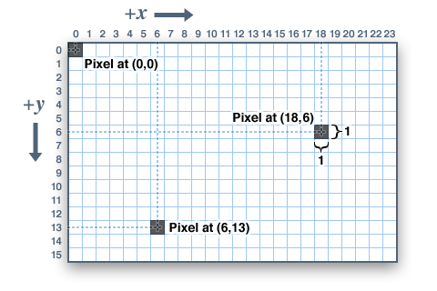

# Code Art Class

## Lesson 2: Draw a line

In this lesson, we'll learn how to draw a line using a bunch of points.

Let's start by drawing a diagonal line from the top left to the bottom right. If you look at the screen coordinates image below, you can notice that if we just set each of the pixels where x==y, we'll draw a line.

We could do this by individually setting each pixel like this:

    img1.point((0, 0), fill ='red')
    img1.point((1, 1), fill ='red')
    img1.point((2, 2), fill ='red')
    img1.point((3, 3), fill ='red')
    img1.point((4, 4), fill ='red')

Note that we just use the same value for both x and y. But in order to do this in a simpler way, we can just use a `for` loop like this:

    for i in range(100):
        img1.point((i, i), fill ='red')

## Challenges

For the following challenges, copy the `line.py` file to be `line1.py` for Challenge 1, `line2.py` for Challenge 2, etc.

### Challenge 1

Make flat horizontal line on top of image.

### Challenge 2

Make flat horizontal line on bottom of image.

### Challenge 3

Make flat vertical line on left of image.

### Challenge 4

Make flat vertical line on right of image.

### Challenge 5

Make flat vertical line in the center of the image.

### Challenge 6

Draw a second line so that there is a horizontal line in the middle of the image and a vertical line in the middle. Together, they should form a + sign.

### Challenge 7

Draw a second line somewhere using the same techniques. Some ideas to try:

* You could try adding some value to either the `x` or `y` coordinates like:

    `img1.point((i+10, i), fill ='red')`

