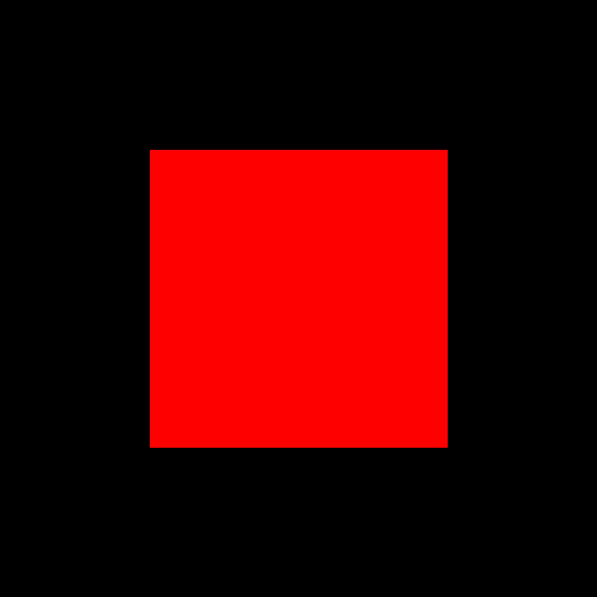

# Code Art Class

## Lesson 4: Colors

In this lesson, we'll learn how to draw a point:

## Challenges

For the following challenges, copy the `colors.py` file to be `colors1.py` for Challenge 1, `colors2.py` for Challenge 2, etc.

### Challenge 1

TODO

### Challenge 2

TODO

