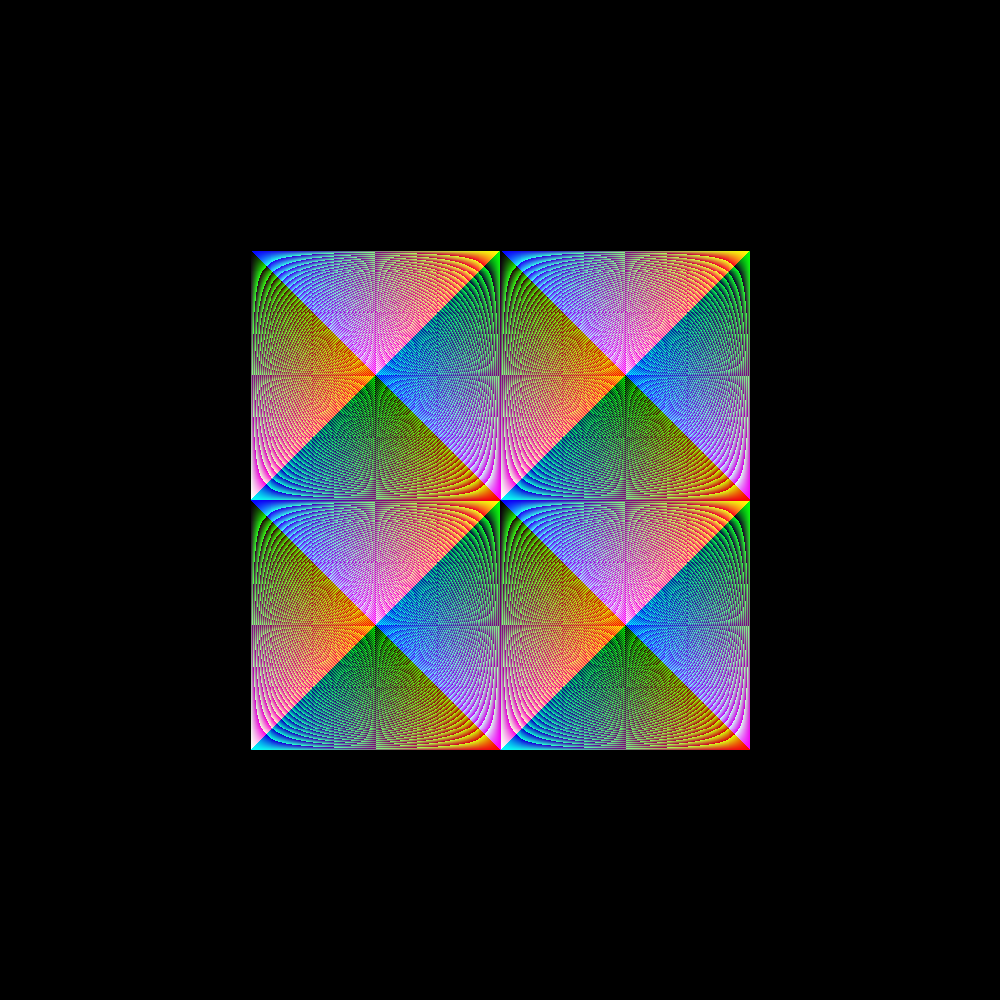

# Code Art Class

## Lesson 1: Draw a point

In this lesson, we'll learn how to draw a point:

## Challenges

For the following challenges, copy the `square.py` file to be `square1.py` for Challenge 1, `square2.py` for Challenge 2, etc.

### Challenge 1

Change the square color from blue to red

### Challenge 2

Cut off the left side of the square by using the conditional: `if x > 250`.

### Challenge 3

Cut off the left and right sides using the conditional: `if x > 250 and x < 750`.

### Challenge 4

Use a compound conditional to cut off all 4 sides by 250 pixels, leaving a square in the middle

